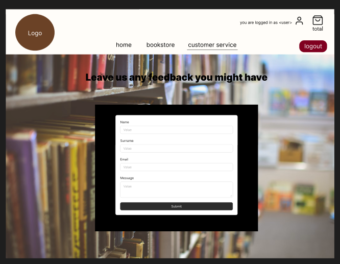

# The Book Loop

[The Book Loop - Deployed Link](https://thebookloop-38d0e34a2881.herokuapp.com/)

The Book Loop is an innovative e-commerce platform dedicated to promoting sustainability and zero waste by offering a unique marketplace for second-hand books. At its core, The Book Loop is more than just a shop—it’s a community-focused initiative that encourages book enthusiasts to reduce environmental impact while enjoying the joy of reading. With an emphasis on reusing and recycling, The Book Loop fosters a sense of connection among readers who value eco-conscious living and the sharing of stories. Whether you’re looking to purchase pre-loved books or contribute to a more sustainable future, The Book Loop provides the perfect space to do both.

## Contents

* [The Book Loop](#the-book-loop)

* [Website Goals and Objectives](#website-goals-and-objectives)

* [Target Audience](#target-audience)

* [Business Model](#business-model)

* [Web Marketing](#web-marketing)

* [Search Engine Optimisation (SEO)](#search-engiine-optimisation-seo)

* [Agile Methodology](#agile-methodology)
  - [Overview](#overview)
  - [Epics](#epics)
  - [GitHub Projects](#github-projects)
  - [User Stories](#user-stories)
  - [Developer Stories](#developer-stories)
  - [Visitor Stories](#visitor-stories)
  - [Registered User Stories](#registered-user-stories)
  - [Admin User Stories](#admin-user-stories)
  - [E-Commerce Features]()

* [Wireframes](#wireframes)

* [Database Schema](#database-schema)

* [Design and Layout](#design-and-layout)
  - [Typography](#typography)
  - [Colour Scheme](#colour-scheme)
  - [Images](#images)
  - [Responsiveness](#responsiveness)

* [Features](#features)
  - [Existing Features](#existing-features)
  - [Future Features](#future-features)
  - [Issues and Bugs](#issues-and-bugs)
    - [Resolved Bugs](#resolved-bugs)
    - [Unresolved Bugs](#unresolved-bugs)

* [Testing](#testing)

* [Technologies Used](#technologies-used)
  - [Frameworks]()

* [Deployment](#deployment)
  * [Heroku]()

* [Credits](#credits)
  - [Media]()

* [Acknowledgements](#acknowledgements)

## Website Goals and Objectives
1. **Promote Sustainability and Zero Waste:**
Advocate for eco-friendly practices by encouraging the reuse of books, reducing waste, and supporting a circular economy within the book-loving community.

2. **Foster a Sense of Community:**
Build a platform that connects readers, collectors, and sustainability advocates, encouraging collaboration and engagement through shared interests in second-hand books.

3. **Provide a Seamless User Experience:**
Offer an intuitive and user-friendly interface for browsing, purchasing, and managing second-hand books, ensuring accessibility for all users, including mobile and desktop visitors.

4. **Support Affordable Reading for Everyone:**
Make literature accessible to a wider audience by providing high-quality second-hand books at affordable prices, breaking down financial barriers to reading.

5. **Encourage Environmental Awareness:**
Educate users on the benefits of sustainability and the positive environmental impact of purchasing pre-owned books, inspiring eco-conscious choices beyond the platform.

## Target Audience

* **Eco-Conscious Readers:**
Individuals who prioritize sustainable living and want to reduce their environmental impact by purchasing second-hand books rather than new ones.

* **Avid Book Lovers:**
Readers who are passionate about exploring a variety of genres and titles while appreciating the charm and affordability of pre-owned books.

* **Students and Educators:**
Students looking for affordable textbooks or leisure reading, as well as educators seeking to build classroom libraries without stretching their budgets.

* **Budget-Conscious Shoppers:**
People who enjoy reading but prefer cost-effective options, finding value in high-quality second-hand books over expensive new copies.

* **Collectors and Vintage Enthusiasts:**
Book collectors and vintage enthusiasts who treasure unique, rare, or out-of-print editions that can often be found in second-hand collections.

* **Community-Oriented Individuals:**
Those who value community-driven initiatives and want to participate in platforms that foster shared interests and social impact.

* **Gift Shoppers:**
Shoppers looking for meaningful, sustainable gifts for book lovers, offering a thoughtful and eco-friendly alternative.

## Business Model

The Book Loop operates on a business-to-consumer (B2C) e-commerce model, selling second-hand books directly to customers through an online platform. The business generates revenue by offering affordable, pre-owned books, with a focus on sustainability and zero waste. By sourcing books through donations, partnerships, or buyback programs, The Book Loop ensures a steady supply of inventory while keeping operational costs low. The platform emphasizes accessibility, offering users a seamless browsing and purchasing experience with features like personalized wish-lists, eco-conscious packaging options, and competitive pricing. This model not only supports environmental sustainability but also promotes a community-driven approach, appealing to both budget-conscious shoppers and environmentally conscious readers.

## Web Marketing

To ensure the success of The Book Loop, a variety of web marketing strategies were implemented to effectively reach and engage the target audience. Leveraging social media platforms and email marketing tools, the project focused on building a strong online presence, fostering a sense of community, and driving traffic to the site.

* **Facebook and Instagram Business Pages:**
A dedicated business page was created on both Facebook and Instagram to showcase The Book Loop’s offerings and mission. These platforms were chosen for their extensive reach and powerful marketing tools. The visually engaging nature of Instagram allowed for the creative presentation of second-hand books through high-quality images, reels, and stories, while Facebook provided an excellent space for building a community, sharing updates, and engaging in discussions. The use of in-depth analytics tools provided by these platforms enabled tracking of post engagement, audience demographics, and conversion rates, ensuring that the marketing efforts were data-driven and highly targeted. Additionally, paid ad campaigns and boosted posts were utilized to expand reach and attract more followers who aligned with The Book Loop’s values.

* **Email Marketing with Mailchimp:**
Mailchimp was utilized to create and manage an email newsletter network, enabling direct communication with users who expressed interest in The Book Loop. Subscribers received regular updates on new book arrivals, special promotions, and community initiatives, fostering ongoing engagement. Mailchimp’s advanced analytics tools allowed for tracking email open rates, click-through rates, and subscriber preferences, ensuring that each newsletter was optimized to meet the audience’s needs. This personalized approach helped build trust and encouraged repeat visits to the site, while maintaining a strong connection with eco-conscious readers and community members.

* **Responsive Design on All Devices:**
A responsive design ensures that the website is fully functional and easy to navigate across all devices, from desktops to mobile phones. This accessibility increases user engagement, enabling customers to browse and shop from anywhere, on any device, even while on the go.

* **Registered User Features to Encourage Sign-Ups:**
By offering additional features to registered users, we aim to build a loyal customer base:
  * **Add to Wish-list:** Users can save books they're interested in, which increases return visits and fosters future sales.
  * **Access to Profile & Delivery Information:** Registered users can view and update their profile, including adding default delivery information for quicker checkout.
  * **Sell Your Own Used Books:** Empowering users to list their own used books helps build a community and encourages participation, driving engagement on the platform.

* **Universal Access for Site Visitors:**
All site visitors can freely browse, add books to their basket, and proceed to checkout without needing to register. This maximizes sales opportunities by reducing barriers to entry, allowing potential customers to shop with ease before deciding to sign up.

* **SEO Implementation for Increased Visibility:**
Search engine optimization (SEO) is key for enhancing the visibility of the website in search engine results. By optimizing content, keywords, and meta tags, we ensure that the site is discoverable to a broader audience, increasing organic traffic and attracting new customers.
    

## Search Engine Optimisation (SEO)

Search Engine Optimization (SEO) is a critical aspect of any online platform, as it enhances the site’s visibility on search engines, driving organic traffic and improving user engagement. For **The Book Loop**, effective SEO strategies were essential to ensure that the platform reached its target audience of eco-conscious readers and book enthusiasts. By optimizing the website’s structure, content, and accessibility, SEO not only improved search engine rankings but also provided a seamless browsing experience for users.

1. **Meta Descriptions and Keywords:**
  Relevant and targeted meta descriptions and keywords were added to every page to improve search engine indexing and attract users searching for second-hand books and sustainability-focused platforms.

2. **Sitemap and robots.txt:**
  A sitemap.xml was created to provide search engines with a clear structure of the site, while a robots.txt file ensured proper indexing of important pages and exclusion of unnecessary ones.

3. **Internal Linking:**
  Every page on the site was made reachable through a link from another findable page, creating a logical structure that improved both user navigation and search engine crawling.

4. **Custom 404 Page:**
  A custom 404 error page was included to provide a user-friendly experience and redirect users to other parts of the site, minimizing frustration and retaining visitors.

In the current project, all links are internal and do not require rel attributes. Internal links contribute to the site's SEO, helping to establish a better structure for search engines to follow.
However, for external links, especially those leading to paid or untrusted content, the following best practices should be considered in the future:

- **rel="nofollow":** This attribute should be applied to external links to prevent search engines from following those links, typically used for links to untrusted or user-generated content.
- **rel="sponsored":** This attribute is recommended for links that are part of paid advertising or sponsorships, signaling to search engines that the link is sponsored.
These practices help ensure that your site adheres to SEO standards and guidelines when linking externally.

## Agile Methodology
### Overview
The use of Agile methodology, demonstrated through GitHub Projects and Kanban boards, was instrumental in ensuring the successful delivery of The Book Loop. Agile’s iterative approach allowed for continuous development and improvement throughout the project lifecycle. By breaking down tasks into manageable sprints and tracking progress on Kanban boards, the development process became more organized and transparent.

Key benefits included:

1. Flexibility and Adaptability
  Agile made it easier to accommodate changes and incorporate new ideas, such as enhancing user interface features or optimizing functionality, without disrupting the overall workflow.

2. Incremental Progress
  Delivering features in small, manageable increments ensured that core functionalities, such as the book catalog and checkout system, were thoroughly tested and improved before moving on.

3. Transparency and Accountability
  Tracking tasks on Kanban boards provided a clear overview of completed, ongoing, and pending tasks, promoting accountability and ensuring deadlines were met.

Overall, Agile empowered the team to maintain a high level of productivity and adapt effectively, ensuring the delivery of a robust and user-friendly platform.

### GitHub Projects
I used GitHub Projects board for this project, so I could easily locate all the issues and mark the completed ones.
[GitHub Projects Board](https://github.com/users/FernVR/projects/7)

### Epics

##### Iteration 1 

##### Iteration 2

##### Iteration 3

##### Iteration 4

##### Iteration 5 

#### Iteration 1 :
Planning and basic set-up and structure.
[Link to Iteration page on github](https://github.com/FernVR/the_book_loop/milestone/1?closed=1)

#### Iteration 2 :
Creating main functionality across all app files.
[Link to Iteration page on github](https://github.com/FernVR/the_book_loop/milestone/2?closed=1)

#### Iteration 3 :
Polishing features and ensuring good functionality across all apps and features.
[Link to Iteration page on github](https://github.com/FernVR/the_book_loop/milestone/3?closed=1)

#### Iteration 4 :
Ensure all design features are polished and front-end checklist is up to date and complete. All code should be tidied and ready for testing and submission.
[Link to Iteration page on github](https://github.com/FernVR/the_book_loop/milestone/4)

#### Iteration 5 :
All Manual and Automated Testing tasks/issues for The Book Loop and all documentation tasks.
[Link to Iteration page on github](https://github.com/FernVR/the_book_loop/milestone/5)

### User Stories
The issues/ user stories were broken down into different categories, developer, visitor, registered-user and admin user stories. This was to separate concerns and ensure that all user functionality was being added. I added personalised labels to the issues so I could see which categories each issue was separated into, and how many from each section I was still working on to complete. 

### Developer Stories
Some examples of developer stories used in The Book Loop:

- As a **developer** I can **create a database instance on my site** so that **I can store data on my deployed site as well as the development version.**

- As a **developer** I can **create views using django templates** so that **I can create a dynamic page that extends functionality across all pages.**

- As a **developer** I can **create custom error handling** so that **I can create a better user experience and a user is easily redirected to the home page.**

*You can access **all** developer stories for this project by redirecting to the issues tab of this repo*

[The Book Loop - Issues - Developer stories](https://github.com/FernVR/the_book_loop/issues?q=is%3Aissue+is%3Aclosed+label%3A%22Dev+Role%22)

### Visitor Stories
Some examples of visitor stories used in The Book Loop:

- As a **visitor** I can **access the bookstore** so that **I can view items available to purchase.**

- As a **visitor** I can **add items to my basket** so that **I can purchase many items at a time.**

- As a **visitor** I can **easily find out more about the site** so that **I can discover different services available and interact with a new community.**

*You can access **all** visitor stories for this project by redirecting to the issues tab of this repo*
[The Book Loop - Issues - Visitor User Stories](https://github.com/FernVR/the_book_loop/issues?q=is%3Aissue+label%3A%22Visitor+User+Story%22+is%3Aclosed)

### Registered User Stories
Some examples of registered-user stories used in The Book Loop:

- As a **registered user,** I can **register/login/logout of the site** so that **I can access all the features of the site and save my information.**

- As a **registered user** I can **add items to my wish-list** so that **I can save items somewhere before I am ready to make a purchase.**

- As a **registered user** I can **access my user profile** so that **I can edit any of my personal details, and view my basket or my wish list/ favourites.**

*You can access **all** registered-user stories for this project by redirecting to the issues tab of this repo*

[The Book Loop- Issues - Registered User Stories](https://github.com/FernVR/the_book_loop/issues?q=is%3Aissue+is%3Aclosed+label%3A%22Registered+User%22)

### Admin User Stories
Some examples of admin user stories used in The Book Loop:

- As a **site admin** I can **easily access the customer support database on the admin panel** so that **I can receive feedback and easily communicate with customers regarding their issues.**

- As a **site administrator** I can **access the admin panel using my admin login credentials** so that **I can access site databases and perform site admin tasks.**

- As a **site administrator** I can **access the product admin features of the site** so that **I can edit, add or delete items for sale.**

*You can access **all** admin-user stories for this project by redirecting to the issues tab of this repo*

[GoodNewsBlog- Issues - Site Admin](https://github.com/FernVR/the_book_loop/issues?q=is%3Aissue+is%3Aclosed+label%3A%22Site+Admin%22)

## Wireframes
I used Figma to create basic wireframes for standard screensizes:

Home Page 1

Home Page 2

Bookstore 1

Bookstore 2

Customer Service

Profile

## Database Schema
I used Lucid Chart to create basic Entity Relationship Diagrams for database schema:
- Note : sell books form from the home page is missing here, this is because I couldn't add it using the free version of Lucid Chart.

## Design and Layout
### Typography

Inika Font is a serif typeface designed with elegance and readability in mind. Its soft, well-balanced letterforms make it ideal for both print and digital platforms. I decided to use this font for:
- include reasons here 

### Colour Scheme

### Images
- I tried to carefully select the images to match the overall theme and aesthetic of the site. I tried to use complimenting colours where possible.
- I selected all book cover images so their were suited to the colour scheme of the site.

Home Page Banner

About Image

Home Page form - bg image

Customer Service form - bg image

Profile Page - bg image

Checkout - bg image

Basket - bg image

### Responsiveness
Website is response across all device screen sizes :
#### Home Page

Home Page Mobile

Home Page Tablet

Home Page Desktop

#### Profile Page

Profile Page Mobile

Profile Page Tablet

Profile Page Laptop

#### Bookstore Page

Bookstore Mobile

Bookstore Tablet

Bookstore Laptop

#### Basket Page

Basket Mobile

Basket Tablet

Basket Laptop

#### Checkout Page

Checkout Mobile

Checkout Tablet

Checkout Laptop

- More responsive testing grids included within [TESTING.md](TESTING.md)

## Features
### Existing Features
#### Header 
- Home link in the logo, accessible on all pages so users can easily get back to the home page
- Nav links accessible on all pages to ensure smooth access to all pages.
- Log status, ensures users can easily check if they are logged in/out.
- Register/Sign In/Sign Out buttons so users can easily log in and out, unregistered users can easily create an account.
- Basket icon and basket total, users can easily see the balance on their basket, and easily click on the basket link to access the basket page and ensures a smooth checkout process.

#### Footer
- Home link in the logo, accessible on all pages so users can easily get back to the home page.
- Social media links, so users are easily redirected to social media pages on a new page.
- Mailchimp Newsletter form, users can easily join the newsletter loop within the footer form, users are notified when their form is submitted successfully.
- Email address contact, ensures a positive user experience in users are encouraged to reach out easily.
- Copright message, users can easily access copright info.

#### Home Page 
- Users can access a button to the store on the landing banner.
- About section, users can read about the site.
- Best seller list, users can access a list of best selling books, encouraging them to explore the bookstore.
- Users can enquire about selling on their second hand books at home through the form.

#### Bookstore
- Users can easily access the book store from the landing banner button, or from the link in the header.
- Users can search for books using the search bar.
- Users can access pagination controls and scroll through multiple pages of books for sale.
- Site admin users can access "add book" button, which brings them to a form where they can submit new book entires
- More details on each book, and a link to add to the basket can be found on the Book Detail page.

#### Book Detail
- Details of each book can be found in their book detail page, details include, title, author, date of publishing, condition, rating and price.
- All users can add books to their basket freely.
- Out of stock books have a disabled button, so users can't accidentally add a book that isn't in stock.
- Registered users can access "Add to Wish list" button, which dynamically adds books to their profile's wish list.
- Site admin users can access product admin functionality here, where they can edit books, and delete books if needed.
- A list of any reviews present on each product detail page, users can read through review messages, and ratings.
- Registered users can add reviews here, using the review form.
- Unregistered users are encouraged to create an account if they are not logged in.

#### Basket 
- Users can access their basket bu clicking on the basket icon in the nav bar.
- On the basket page, users can view their basket items, and remove any items using the remove button.
- Users can click on either 'keep shopping' to return to the bookstore, or click 'checkout' to move to the checkout page.
- Users will be informed if their basket is empty.

#### Checkout
- Users can access the checkout page from the basket page.
- Users can view their order summary, with a price breakdown and the total.
- Users can fill in their delivery and card details and checkout
- Registered/Logged in users can use their default info here to ensure a fast and smooth checkout process.

#### Checkout Sucess
- Users are redirected to the checkout success page upon making a successful payment.
- They are shown a nice message as well as their order summary, and a button to return to the bookstore.

#### User Authentication
- Users can easily login/out/register on The Book Loop, ensuring a good user experience.
- Registered users can access different features only available to them, encouraging user sign up.
- Anonymous users can easily create a new account.
- Registered users can easily delete their account and info on their profile page, ensuring good security accross the site.

#### User Profile
- Users can access their profile through the link in the nav, only visible to registered users.
- Users can edit their user information, delivery details and wish-list.
- Users can delete their account on the button on this page.
- Users can add to their wish list, and easily remove items, or add them to their basket.

#### Customer Service
- All users can access the customer service page from the navigation bar.
- Users can submit enquiries, complaints or anything else regarding their purchases, this ensures good communication between the business and customers.

#### 404 Error Page
- Should a user access any non-existing pages or another 404 error, they are displayed a message and a link to head back to the home page.

### Future Features 
* **Book Recommendations Engine**:
A personalized book recommendation system that uses machine learning algorithms to suggest books based on user preferences, browsing history, and wish-list items. This will enhance the user experience and encourage more purchases.

* **Book Trading/Swapping Feature**:
An option for users to trade or swap their books with other registered users. This feature will promote sustainability and community interaction, allowing users to exchange books they no longer need for new ones.

* **Advanced Search Filters**:
Enhanced search functionality that includes filters based on book genre, condition (new, like-new, or used), price range, author, and rating. This will make it easier for users to find books that match their exact preferences.

* **Subscription Box Service**:
A monthly subscription service that delivers a curated selection of books to users based on their reading preferences. This would cater to niche audiences, including book lovers, collectors, and people who enjoy surprises.

* **Book Clubs and Community Forums**:
A section of the site dedicated to virtual book clubs and community discussions. Users will be able to join or create book clubs, engage in discussions, and organize virtual events to meet like-minded readers.

### Issues and Bugs 
#### Resolved Bugs 
* All bug-related documentation can be found within [TESTING.md](TESTING.md)
* All recorded resolved bugs can also be found within [Github Issues]()
#### Unresolved Bugs
* All bug-related documentation can be found within [TESTING.md](TESTING.md)
* All recorded resolved bugs can also be found within [Github Issues]()

## Testing
* All testing documentation can be found within [TESTING.md](TESTING.md)

## Technologies Used
### Languages Used

* [Python](https://www.python.org/doc/)
* [Django](https://www.djangoproject.com/)
* [Javascript](https://en.wikipedia.org/wiki/JavaScript)
* [CSS](https://en.wikipedia.org/wiki/CSS)
* [HTML](https://en.wikipedia.org/wiki/HTML)

### Frameworks, Libraries & Programs Used

1. [Visual Studio Code](https://code.visualstudio.com/)
    - I used Visual Studio Code as editor for this project.

1. [GitPod:](https://www.gitpod.io/)
    - I used GitPod as my editor for this project.

1. [Git](https://git-scm.com/)
    - Git was used for version control by utilizing the Gitpod terminal to commit to Git and Push to GitHub.

1. [GitHub:](https://github.com/)
    - GitHub is used to store the projects code after being pushed from Git.

1. [Django:](https://www.djangoproject.com/)
    - I used Django as the python framework.

1. [Bootstrap:](https://getbootstrap.com/)
    - I used Boostrap as the HTML/CSS framwork.

1. [Python Tutor Visual Debugger:](https://pythontutor.com/)
    - I used Python Tutor for debugging.

1. [Heroku:](https://heroku.com)
    - For final deoployment.

1. [Notes:](https://apple.com/notes/)
    - I used the apple notes app on both my iPad and my iPhone for sketches, or any other planning/checklists used for this project.

1. [Lucid Charts:](https://apple.com/notes/)
    - I used Lucid Charts to create a database schema for GoodNewsBlog.

1. [Figma:](https://www.figma.com/)
    - I used Figma to create wireframes for this project.

1. [Favicon Generator](https://favicon.io/favicon-generator/)
    - I used Favicon generator to generate the favicon icon in the browser for free.

1. [Apple Numbers:](https://apple.com/numbers/)
    - I used the Numbers app on my iPad pro to create testing spreadsheets.

## Deployment 
### Github
1. Login (or sign up) to Github.
2. Find the repository for this project, FernVR/the_book_loop.
3. Click on the Settings link.
4. Click on the Pages link in the left-hand side navigation bar.
5. In the Source section, choose main from the drop-down select branch menu. Select Root from the drop-down select folder menu.
6. Click Save. Your live Github Pages site is now deployed at the URL shown.cal machine.

### Heroku
The deployment is made using [Heroku](https://www.heroku.com/) following the listed steps:

1. Log in or register a new account on Heroku
2. Click on 'New' in the dashboard and select 'Create New App'
3. Select a name for the app and choose your region.
4. Click on "Create app"
5. When the app is created click on Setting
6. To improve compatibility with various Python libraries add Config Var with Key = PORT and the Value = 8000
7. Add 2 buildpacks: Python and then Nodejs in this specific order 
8. Go back at the top and click on "Deploy" and select "GitHub"
9. Scroll down and click on 'Connect to GitHub'
10. Search for your GitHub repository name by typing it
11. Click on "Connect"
12. Scroll down and click on "Deploy Branch"
13. You will see a message "The app was successfully deployed" when the app is built with python and all the depencencies
14. Click on view and you will see the deployed site

#### How to Clone

1. Login (or sign up) to GitHub.
2. Go to the repository for this project, it can be found here (link)
3. Click on the code button, select whether you would like to clone with HTTPS, SSH, or GitHub CLI, and copy the link shown.
4. Open the terminal in your code editor and change the current working directory to the location you want to use for the cloned directory.
5. Type 'git clone' into the terminal and then paste the link you copied in step 3. Press enter.

## Credits 
### Media
#### Site Media
* Logo:
* Background images:

#### Product Media

### Code 
Include all documentation

### Content
* Descriptions on books

## Acknowledgments 
* Code Institute and its amazing Slack community for their support and providing me with the necessary knowledge to complete this project.

* My mentor Sandeep, for providing a lot of knowledge, guidance and very helpful reading materials.

[Back To Top](#the-book-loop)

