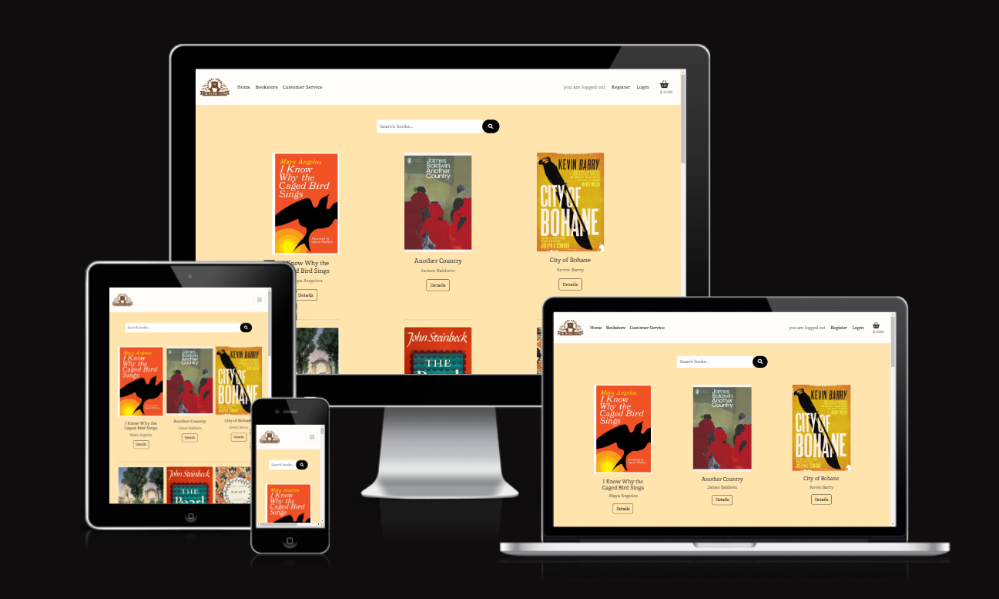

# Testing 
Back to [README.md](README.md) file.

# Contents 
- [Code Validation](#code-validation)
    - [HTML](#html)
    - [CSS](#css)
    - [Javascript](#javascript)
    - [Python](#python)

- [Python Unit Testing](#python-unit-testing)

- [Automated Testing](#automated-testing)

- [Manual Testing](#manual-testing)
    - [Home Page](#home-page)
    - [Bookstore]()
    - [Book Detail]()
    - [Basket]()
    - [Checkout]()
    - [Sign up/ Sign In/ Sign Out Pages](#sign-up-sign-in-sign-out-pages)
    - [Customer Service Form]()
    - [Profile Page]()
    
- [User Story Testing](#user-story-testing)
    - [Developer User Stories](#developer-user-stories)
    - [Visitor User Stories](#visitor-user-stories)
    - [Registered User Stories](#resgistered-user-stories)
    - [Admin User Stories](#admin-user-stories)

- [UI](#ui)

- [Bugs](#bugs)

- [Browser Compatibility](#browser-compatibility)

- [Lighthouse Test Result](#lighthouse-test-result)

## Code Validation
### HTML 
I used [The W3C Markup Validation Service](https://validator.w3.org/) to validate all HTML pages by inputting the source code into the direct input field, these were my results:

### CSS
I used [The W3C CSS Validation Service](https://jigsaw.w3.org/css-validator/) to validate my style.css file, I got these results:

### Javascript
I used [JSHint](https://jshint.com/) to validate my style.css file, I got these results:

### Python
I used [The CI Python Linter](https://pep8ci.herokuapp.com/) to validate my python files, I got these results:

## Python Unit Testing
Results for testing report can be found in [test_report.txt](test_report.txt) which I generated using the 'python manage.py test -v 2 > test_report.txt' command in the terminal.

Python Unittest Result
 

### Automated Testing
Testing functions can be found in these files:
[appname/Test Forms](appname/tests.py)
[appname/Test Forms](appname/tests.py)
[appname/Test Forms](appname/tests.py)
[appname/Test Forms](appname/tests.py)
[appname/Test Forms](appname/tests.py)

Automated testing
 

## Manual Testing
Extensive Manual Testing was carried out during the duration of this project. I tried to test each feature/link upon creating them, I have also included screenshots of the testing grids I created.
### Home Page
copy this structure for each page:

Links and Buttons 
 

Display and Images
 

Responsive Design Grid 
 

### Bookstore 
"" ""

### Book Detail 

### Basket

### Checkout

### Sign up/ Sign In/ Sign Out Pages

### Customer Service

### Profile Page

## User Story Testing

### Developer User Stories
### Visitor User Stories
### Resgistered User Stories
### Admin User Stories

## UI

## Bugs
### Resolved Bugs
### Unresolved Bugs

## Browser Compatibility

Browser Compatibility Grid 
 

## Lighthouse Test Result
 I generated a Google Lighthouse report and got this result:

 
