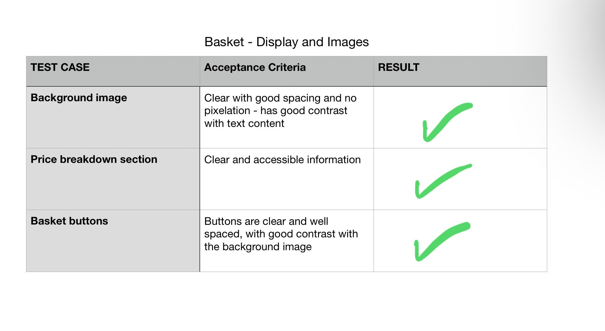
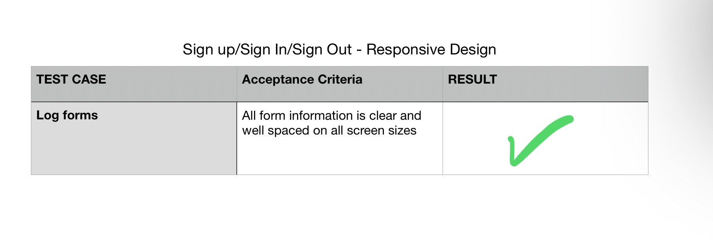
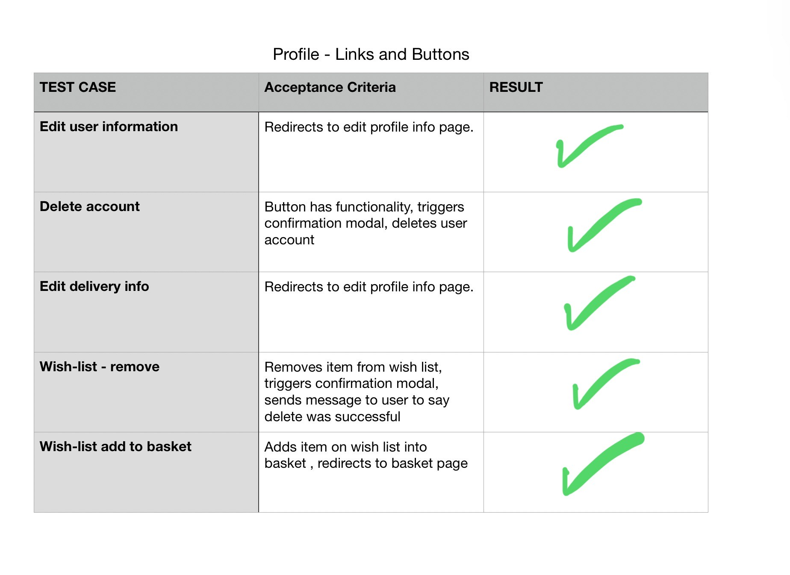
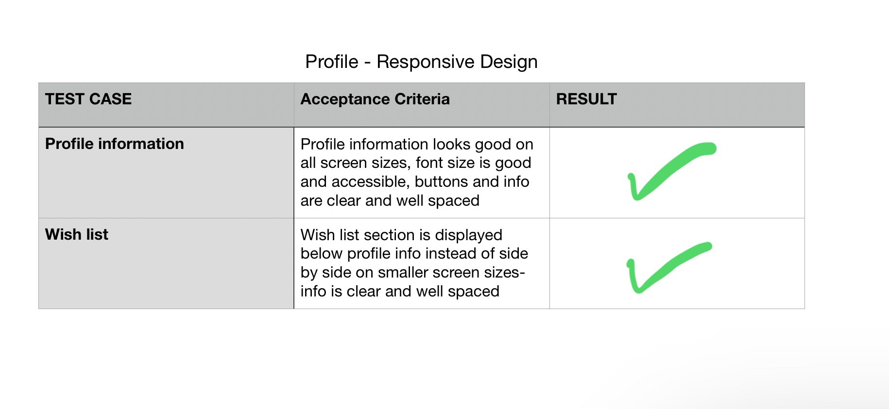

# Testing 
Back to [README.md](README.md) file.

# Contents 
- [Code Validation](#code-validation)
    - [HTML](#html)
    - [CSS](#css)
    - [Javascript](#javascript)
    - [Python](#python)

- [Python Unit Testing](#python-unit-testing)

- [Automated Testing](#automated-testing)

- [Manual Testing](#manual-testing)
    - [Home Page](#home-page)
    - [Bookstore]()
    - [Book Detail]()
    - [Basket]()
    - [Checkout]()
    - [Sign up/ Sign In/ Sign Out Pages](#sign-up-sign-in-sign-out-pages)
    - [Customer Service Form]()
    - [Profile Page]()
    
- [User Story Testing](#user-story-testing)
    - [Developer User Stories](#developer-user-stories)
    - [Visitor User Stories](#visitor-user-stories)
    - [Registered User Stories](#resgistered-user-stories)
    - [Admin User Stories](#admin-user-stories)

- [UI](#ui)

- [Bugs](#bugs)

- [Browser Compatibility](#browser-compatibility)

- [Lighthouse Test Result](#lighthouse-test-result)

## Code Validation
### HTML 
I used [The W3C Markup Validation Service](https://validator.w3.org/) to validate all HTML pages by inputting the source code into the direct input field, these were my results:

Home Page Result

Bookstore Page Result

Book Detail Page Result

Customer Service Page Result

Profile Page Result

### CSS
I used [The W3C CSS Validation Service](https://jigsaw.w3.org/css-validator/) to validate my style.css file, I got these results:

### Javascript
I used [JSHint](https://jshint.com/) to validate my style.css file, I got these results:

stripe.js

wishlist.js

rating-slider.js

image-preview.js

delete-book.js

### Python
I used [The CI Python Linter](https://pep8ci.herokuapp.com/) to validate my python files, I got these results:

basket/contexts.py

basket/urls.py

basket/views.py

bookstore/models.py

bookstore/views.py

checkout/views.py

customer-service/views.py

home/views.py

profile/views.py

## Python Unit Testing
Results for testing report can be found in [test_report.txt](test_report.txt) which I generated using the 'python manage.py test -v 2 > test_report.txt' command in the terminal.

### Automated Testing
I ended up stretched for time and couldn't carry out as much automated testing as I would've wanted, but I managed to test the bookstore and basket views files.
Testing functions can be found in these files:

[basket/Tests](basket/test_views.py)

[bookstore/Tests](bookstore/test_views.py)

Automated testing
 

## Manual Testing
Extensive Manual Testing was carried out during the duration of this project. I tried to test each feature/link upon creating them, I have also included screenshots of the testing grids I created.

### Header Navigation / Footer

Links and Buttons 
 

Display and Images
 

Responsive Design Grid 
 

Forms 
 

### Home Page

Links and Buttons 
 

Display and Images
 

Responsive Design Grid 
 

Forms 
 

### Bookstore 

Links and Buttons 
 

Display and Images
 

Responsive Design Grid 
 

### Book Detail 

Links and Buttons 
 

Display and Images
 

Responsive Design Grid 
 

Forms 
 

### Basket

Links and Buttons 
 

Display and Images
 

Responsive Design Grid 
 

### Checkout

Links and Buttons 
 

Display and Images
 

Responsive Design Grid 
 

Forms 
 

### Sign up/ Sign In/ Sign Out Pages

Links and Buttons 
 

Display and Images
 

Responsive Design Grid 
 

Forms 
 

### Customer Service

Links and Buttons 
 

Display and Images
 

Responsive Design Grid 
 

Forms 
 

### Profile Page

Links and Buttons 
 

Display and Images
 

Responsive Design Grid 
 

Forms 
 

## Bugs

### Resolved Bugs
Complete list of all resolved bugs can be found in detail within the issues within the 'bug' label, they can all be found here: [Github Issues - Bugs](https://github.com/FernVR/the_book_loop/issues?q=is%3Aissue+is%3Aclosed+label%3Abug)

### Unresolved Bugs
I didn't have time to fix a few bugs within this project so close to the due date, just minor UI issues.
These issues are marked with a 'wontfix' label and their detailed issues can be found here: [Github Issues - Bugs - wontfix](https://github.com/FernVR/the_book_loop/issues?q=is%3Aissue+is%3Aclosed+label%3Awontfix)

## Browser Compatibility

Browser Compatibility Grid 
 

## Lighthouse Test Result
 I generated a Google Lighthouse report and got these results:

 

Home Result

 

Home Performance

 

Home SEO

 

Home Best Practises

 

Bookstore Result

 

Bookstore Accessibility

 

Bookstore Performance

 

Bookstore Best Practises

 

Bookstore SEO

 * I received some lower performance scores and tried to make changes to the image sizing to hopefully fix these issues - unfortunately the book covers I added were in PNG and I didn't have time to convert them, like I did for the background images.

 * I tried to ensure SEO and Accessibility scores were 100 across all pages.

 * Not sure what to do about the 'Best Practices' scores, I didn't have much time to make changes here so close to the deadline.

 
